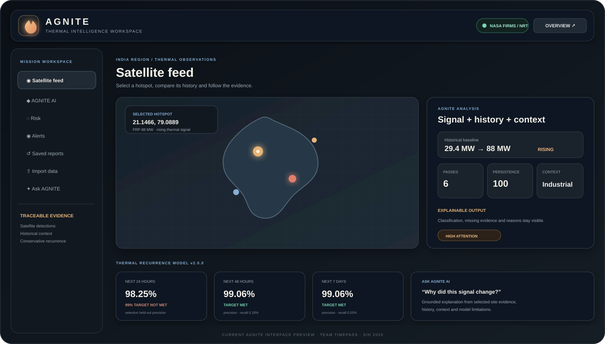
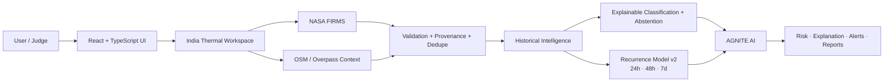

<p align="center">
  
</p>

<h1 align="center">AGNITE</h1>

<p align="center"><strong>AI-Powered Thermal Intelligence for India</strong></p>
<p align="center">Detect · Contextualize · Classify · Predict · Explain · Act</p>

<p align="center">
  <a href="https://github.com/goyalparth61-netizen/Agnite/actions/workflows/ci.yml"></a>
  <a href="https://github.com/goyalparth61-netizen/Agnite/stargazers"></a>
  
  
  
  
  <a href="LICENSE"></a>
</p>

<p align="center"><strong>Team Timepass · Quantum University · Smart India Hackathon 2026 · SIH26162</strong></p>

<p align="center">
  <a href="https://github.com/goyalparth61-netizen/Agnite/stargazers">
    
  </a>
</p>

---

## What is AGNITE?

**AGNITE** is an India-focused thermal-intelligence platform built for SIH26162: **AI-Based Detection and Classification of Industrial Fires and Persistent Thermal Sources Using NASA FIRMS**.

Most hotspot viewers answer only **where heat was detected**. AGNITE continues the investigation:

```text
PAST → PRESENT → CONTEXT → CLASSIFY → RECURRENCE → EXPLAIN → ACT
```

For a selected thermal hotspot, the platform combines NASA FIRMS observations, historical behaviour, mapped industrial/geographic context, explainable classification, a trained thermal-recurrence model, AGNITE AI, monitoring and alerts.

> [!IMPORTANT]
> AGNITE is a decision-support prototype. A NASA FIRMS hotspot is a **satellite thermal detection**, not automatically a confirmed fire or verified cause.

---

## Product preview

<p align="center">
  
</p>

The current workspace is organized around one judge-friendly flow: **select hotspot → analyze signal → inspect history/context → review recurrence → ask AGNITE AI → monitor or export**.

---

## Why it stands out

| Question a user asks | AGNITE response |
| --- | --- |
| Where is thermal activity happening? | India-focused interactive NASA FIRMS map |
| Has this location behaved like this before? | Historical detections, FRP baseline, trend and persistence |
| Is it likely routine industrial heat or an abnormal pattern? | Explainable multi-class classifier with conservative abstention |
| What surrounds the hotspot? | OpenStreetMap / Overpass industrial and geographic context |
| What may happen next? | Trained 24h / 48h / 7d thermal-recurrence model |
| Why did the system say that? | Evidence factors, missing evidence and AGNITE AI explanation |
| Can I monitor it? | Saved watches, thresholds, reports and optional confirmed email alerts |
| What if evidence is weak? | Explicit `Insufficient evidence` / low-confidence states instead of forced certainty |

---

## Core capabilities

### Interactive thermal map
- VIIRS NOAA-20, VIIRS Suomi NPP and MODIS Terra/Aqua feeds.
- 24h, 48h and 7d observation windows.
- Search, FRP filters, sorting, hotspot selection and CSV export.
- Fresh / stale / unavailable provenance states are shown explicitly.

### Historical thermal intelligence
For a selected site AGNITE derives:
- previous nearby detections;
- current and baseline FRP;
- deviation from baseline;
- recent trend;
- recurrence and repeated passes;
- observed-day persistence;
- saved-report history.

### Explainable classification
Current experimental classes:
- **Industrial Fire**
- **Persistent Industrial Heat**
- **Forest / Natural Fire**
- **Other Thermal Anomaly**
- **Insufficient evidence** when the gate is not satisfied

### Persistent-heat separation
Routine industrial heat can repeat around furnaces, kilns, power facilities and process sites. AGNITE therefore compares recurrence, baseline behaviour and mapped context before treating repeated heat as an abnormal event.

### Spatial context
`/api/site-context` queries bounded OpenStreetMap / Overpass context such as industrial land use, works, power facilities, forest, scrub, water and residential areas. Proximity is supporting evidence, not proof of causality.

### Trained thermal-recurrence model
The committed **v2.0.0** artifact is trained from historical NASA FIRMS Standard Processing VIIRS observations from **2024–2025**.

Target: whether another FIRMS thermal detection occurs in the same approximately 2 km spatial cell within **24h, 48h or 7d**.

This is intentionally different from claiming a confirmed future fire.

### AGNITE AI
AGNITE AI is grounded in the selected hotspot. It can explain:
- why the current pattern was classified a certain way;
- what changed from historical baseline;
- whether persistence matters;
- what the 24h / 48h / 7d output means;
- what evidence is missing;
- what verification or safety action should be considered.

The app supports a local evidence-grounded fallback plus an optional server-side OpenAI-compatible provider.

### Monitoring, alerts and reports
- browser-saved watched locations;
- FRP threshold matching;
- report snapshots;
- CSV / JSON / SVG-style export workflows;
- optional consent + confirmation based email alerts.

---

## Validation snapshot

### Historical NASA FIRMS recurrence model v2

Training pipeline processed **1,470,795 grouped FIRMS events/examples** with a chronological holdout of **294,159** observations.

| Horizon | Conservative threshold | Precision | Recall | 99% precision target |
| --- | ---: | ---: | ---: | --- |
| 24h | 0.998510 | **98.25%** | 0.24% | ❌ Not met |
| 48h | 0.999778 | **99.06%** | 0.18% | ✅ Met |
| 7d | 0.999996 | **99.06%** | 0.55% | ✅ Met |

These are **high-confidence selective positive decisions**. The very low recall is intentional and must be disclosed: the model abstains on most cases to protect precision.

> [!CAUTION]
> **99.06% precision on held-out thermal-recurrence labels is not 99% fire-prediction accuracy.** The target is repeat satellite thermal detection, not a verified incident.

### Thermal classifier
The bundled four-class classifier is synthetic-trained for pipeline demonstration and explainability. On its synthetic holdout it records **93.75% accuracy**. Its selective gate reaches **99.08% precision at 81.13% coverage** on synthetic held-out examples only. These numbers are not field validation.

Full methodology: **[docs/ML_PIPELINE.md](docs/ML_PIPELINE.md)**.

---

## Architecture



Detailed design: **[docs/ARCHITECTURE.md](docs/ARCHITECTURE.md)**.

---

## Demo in 90 seconds

1. Open **Dashboard → Satellite feed**.
2. Select a hotspot with useful history or click **Load demo scenario**.
3. Open **AGNITE AI / Analysis** to show baseline, trend, context, classification and evidence.
4. Open **Risk** to show 24h / 48h / 7d recurrence output and conservative confidence gate.
5. Open **Ask AGNITE** and ask: `Why is this hotspot risky and what evidence is missing?`
6. Finish with **Alerts / Saved reports**.

A deterministic industrial-spike fallback is built into the application, and additional importable scenarios are included under **[`demo/`](demo/README.md)**.

Full judging script: **[docs/DEMO_GUIDE.md](docs/DEMO_GUIDE.md)**.

---

## Technology stack

| Layer | Technology |
| --- | --- |
| Frontend | React, TypeScript, Vite |
| Motion | Framer Motion |
| Mapping | Leaflet, OpenStreetMap |
| Charts | Recharts |
| Backend | Node.js ESM HTTP server |
| Satellite data | NASA FIRMS |
| Spatial context | OpenStreetMap / Overpass |
| ML training | Python, pandas, NumPy, scikit-learn |
| ML runtime | TypeScript + portable JSON artifacts |
| AI assistant | Local grounded mode + optional OpenAI-compatible provider |
| Email alerts | Resend-compatible workflow |
| Deployment | Render-ready single Node service |
| CI | GitHub Actions |

---

## Project status

| Area | Status |
| --- | --- |
| Multi-page product UI | ✅ Ready |
| India-focused thermal workspace | ✅ Ready |
| NASA FIRMS integration | ✅ Ready |
| Historical analysis | ✅ Ready |
| OSM context | ✅ Ready |
| Thermal classifier | 🧪 Experimental / synthetic-trained |
| Recurrence model v2 | ✅ Trained on historical FIRMS data |
| 48h / 7d high-precision gate | ✅ 99% target met on chronological holdout |
| 24h high-precision gate | ⚠️ 98.25%, target not met |
| AGNITE AI local mode | ✅ Ready |
| External AI provider | ⚙️ Optional configuration |
| Watches / saved reports | ✅ Ready |
| Email alerts | ⚙️ Optional configuration |
| Tests / production build / CI | ✅ Passing |

---

## Run locally

### Prerequisites
- Node.js **22+**
- npm
- Internet access for NASA FIRMS, map tiles and OSM context
- Python only for retraining historical models

```bash
git clone https://github.com/goyalparth61-netizen/Agnite.git
cd Agnite
npm ci
npm run dev
```

Development endpoints:

```text
Frontend  http://localhost:5173
Backend   http://127.0.0.1:8787
```

Verification:

```bash
npm test
npm run build
```

Production:

```bash
npm start
```

---

## Reproduce the recurrence model

```powershell
python -m pip install -r ml/requirements.txt
$env:NASA_FIRMS_MAP_KEY="<your key>"

python scripts/download-firms-history.py `
  --start 2024-01-01 `
  --end 2025-12-31 `
  --source VIIRS_NOAA20_SP

$files = Get-ChildItem "data\firms\VIIRS_NOAA20_SP_2024-*.csv","data\firms\VIIRS_NOAA20_SP_2025-*.csv" |
  Select-Object -ExpandProperty FullName

python scripts/train-firms-recurrence-model-v2.py @files
```

Raw historical downloads are intentionally ignored by Git. Only reviewed model artifacts should be committed.

---

## Documentation

| Document | Purpose |
| --- | --- |
| **[Documentation Hub](docs/README.md)** | Start here |
| **[Architecture](docs/ARCHITECTURE.md)** | System design and data flow |
| **[API Reference](docs/API.md)** | Backend routes and behaviour |
| **[ML Pipeline](docs/ML_PIPELINE.md)** | Classifier + recurrence training and validation |
| **[Data & Limitations](docs/DATA_AND_LIMITATIONS.md)** | Provenance, uncertainty and responsible claims |
| **[Demo Guide](docs/DEMO_GUIDE.md)** | Judge-ready demo scenarios and script |
| **[Deployment](docs/DEPLOYMENT.md)** | Local and Render deployment |
| **[Project Structure](docs/PROJECT_STRUCTURE.md)** | Repository organization |
| **[Roadmap](docs/ROADMAP.md)** | Validation and production roadmap |

---

## Team Timepass

| Member | Program |
| --- | --- |
| **Archi Sharma** | B.Tech AI/ML |
| **Parth Goyal** | B.Tech CSCQ |
| **Sonu Sharma** | B.Tech CSCQ |
| **Nandani Gautam** | BCA |
| **Dipanshu Jasrotia** | B.Tech CSCQ |
| **Dipanshu Negi** | B.Tech CSE |

**Quantum University · Smart India Hackathon 2026 · SIH26162**

---

## Responsible-use statement

AGNITE is not an emergency-response authority. Satellite coverage, cloud, overpass timing, missing observations, map completeness and label quality can affect results. Always use official alerts, field verification and qualified safety procedures for real incidents.

---

## Support the project

If you find the idea useful, **star the repository** — it helps the project reach more builders, reviewers and collaborators.

<p align="center">
  <a href="https://github.com/goyalparth61-netizen/Agnite/stargazers"><strong>⭐ Star AGNITE on GitHub</strong></a>
</p>

<p align="center"><sub>Built with purpose by Team Timepass.</sub></p>
