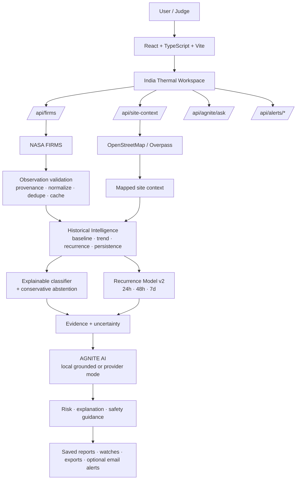

# AGNITE System Architecture

## Purpose

AGNITE is an India-focused thermal-intelligence platform that turns satellite thermal detections into a structured decision-support workflow:

**Detect → contextualize → compare history → classify/abstain → estimate recurrence → explain → monitor.**

The architecture is intentionally transparent: provenance, model limitations, stale data, missing context and uncertainty are visible rather than hidden.

---

## High-level architecture



---

## Frontend

The frontend is a React/Vite single-page application using hash-based navigation.

### Primary surfaces

- **Home** — product story, 60-second user flow, project preview and team identity.
- **Platform** — product capability explanation.
- **Intelligence** — explainable analysis concepts.
- **Risk & Alerts** — recurrence, risk and monitoring concepts.
- **Learn** — documentation / awareness.
- **About** — Team Timepass and project mission.
- **Workspace** — operational surface for feed, analysis, risk, alerts, reports, import and AGNITE AI.

### Workspace tabs

```text
Satellite feed
AGNITE AI / Analysis
Risk
Alerts
Saved reports
Import data
Ask AGNITE
```

Key frontend modules:

- `src/pages/`
- `src/components/`
- `src/hooks/`
- `src/ai/`
- `src/styles/`

---

## Backend

The production backend is a lightweight Node.js ESM HTTP server in `server/index.mjs`.

Responsibilities:

- retrieve and normalize fixed NASA FIRMS public feeds;
- validate sensor/time-window query parameters;
- apply bounded India-region filtering;
- deduplicate concurrent upstream requests;
- cache successful FIRMS responses for ten minutes;
- surface stale cache explicitly after upstream failure;
- proxy bounded OpenStreetMap / Overpass site-context queries;
- handle AGNITE AI provider calls server-side;
- manage optional confirmed email-alert subscriptions;
- serve the compiled frontend from `dist/`.

The single-service topology keeps provider keys out of the browser and avoids unnecessary CORS complexity.

---

## Data and provenance layer

Every observation is assigned a source category:

- `firms` — NASA FIRMS data returned by the server;
- `imported` — user-uploaded CSV data;
- `manual` — manually entered local data;
- `demo` — explicitly simulated demonstration data.

AGNITE never silently changes one provenance class into another. Simulated and non-simulated histories are isolated.

### NASA reliability controls

- fixed upstream source allowlist;
- query allowlist;
- response-size limits;
- timeout handling;
- de-duplication;
- ten-minute cache;
- explicit stale-cache state;
- no synthetic replacement after NASA failure.

---

## Historical intelligence

`src/ai/intelligence.ts` summarizes evidence around the selected site.

Derived signals include:

- previous detections;
- distinct satellite passes;
- peak and average FRP;
- historical baseline FRP;
- current deviation from baseline;
- recent rising / stable / falling trend;
- recurrence per day;
- persistence across observed days;
- missing contextual evidence;
- relevant saved-report history.

This layer supplies consistent context to both the classifier and recurrence model.

---

## Thermal classification

`src/ai/thermalEngine.ts` applies the bundled four-class multinomial classifier.

Classes:

- Industrial Fire
- Persistent Industrial Heat
- Forest / Natural Fire
- Other Thermal Anomaly

The classifier is **synthetic-trained** and used to demonstrate explainable classification and abstention. It should not be presented as field-validated industrial-fire identification.

The engine can return **Insufficient evidence** when history, context, score or margin requirements are not satisfied.

---

## Historical recurrence model v2

`src/ai/recurrenceModel.ts` loads `src/ai/recurrence-model.json`.

The current artifact is:

```text
name     AGNITE NASA FIRMS Thermal Recurrence Model
version  2.0.0
trained  true
source   Historical NASA FIRMS Standard Processing VIIRS observations
```

Prediction target:

> another FIRMS thermal detection in the same approximately 2 km spatial cell within 24h, 48h or 7d.

Current high-confidence validation:

| Horizon | Precision | Recall | Target |
| --- | ---: | ---: | --- |
| 24h | 98.25% | 0.24% | 99% not met |
| 48h | 99.06% | 0.18% | 99% met |
| 7d | 99.06% | 0.55% | 99% met |

The very low recall is an explicit consequence of conservative thresholding.

---

## AGNITE AI

AGNITE AI receives structured selected-site evidence rather than unrestricted raw application state.

Two modes exist:

### Local grounded mode
- deterministic evidence-aware answers;
- works without an external LLM key;
- preserves source labels and limitations.

### External provider mode
- server-side OpenAI-compatible provider;
- receives a bounded conversation window and selected-site evidence;
- falls back to local mode on provider/network failure.

Provider secrets are never required in the browser bundle.

---

## Alerts and reporting

The workspace supports:

- saved reports in browser storage;
- watched locations and FRP thresholds;
- imported/manual observations;
- CSV / JSON / visual export workflows;
- optional confirmation-based email alerts;
- contact delivery when configured.

Production email alerts are based on real supported feed data, not demo rows.

---

## Deployment topology

```mermaid
flowchart LR
    B[Browser] --> R[Render / Node Service]
    R --> STATIC[dist/ frontend]
    R --> FIRMS[/api/firms]
    R --> SITE[/api/site-context]
    R --> ASK[/api/agnite/ask]
    R --> ALERTS[/api/alerts/*]
    R --> CONTACT[/api/contact]
    FIRMS --> NASA[NASA FIRMS]
    SITE --> OSM[OSM / Overpass]
    ASK --> LLM[Optional OpenAI-compatible provider]
    ALERTS --> EMAIL[Optional email provider]
```

---

## Security and reliability controls

- strict coordinate/date/numeric validation;
- bounded file import sizes;
- duplicate removal;
- spatial filtering;
- fixed upstream URLs;
- server-side secrets;
- origin checks on sensitive endpoints;
- static path traversal protection;
- source/provenance labels;
- model abstention;
- confidence/limitation messaging;
- deterministic test fixtures;
- GitHub Actions running tests and production build.

---

## Design principle

AGNITE favors **traceable evidence over impressive-looking certainty**. Every output should be explainable back to source, history, context, model state and missing evidence.
