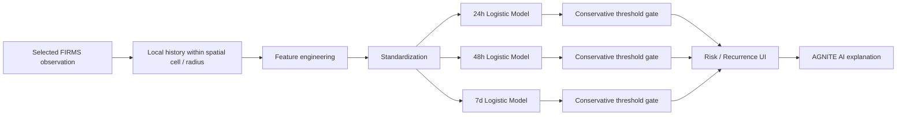

# AGNITE ML Pipeline

## Scope

AGNITE has two separate intelligence paths and documents them independently because they answer different questions:

1. **Thermal-source classification** — what pattern best fits the selected hotspot?
2. **Historical thermal recurrence** — is another FIRMS thermal detection likely to occur in the same spatial cell within 24h, 48h or 7d?

Neither path should be generalized into an unsupported claim of real-world fire certainty.

---

## 1. Thermal-source classifier

### Classes

- Industrial Fire
- Persistent Industrial Heat
- Forest / Natural Fire
- Other Thermal Anomaly
- Insufficient evidence (abstention state)

### Feature families

The current classifier uses derived features such as:

- current FRP;
- current-to-baseline ratio;
- observed-day coverage / persistence;
- industrial proximity;
- forest / industrial / urban context;
- wind when supplied.

### Model

The bundled artifact in `src/ai/model.json` is a **multinomial logistic-regression model trained on seeded synthetic archetypes**.

Current synthetic validation snapshot:

| Metric | Value |
| --- | ---: |
| Training examples | 2,600 |
| Validation examples | 800 |
| Synthetic validation accuracy | 93.75% |
| Selective precision | 99.08% |
| Selective coverage | 81.13% |
| Score threshold | 0.805 |
| Margin threshold | 0.10 |

The selective precision figure applies **only to synthetic held-out examples from the same generator family**. It is not field accuracy.

### Conservative abstention

AGNITE can withhold a class when evidence is insufficient or ambiguous. This is deliberate. A trustworthy `Insufficient evidence` response is preferred over a confident but unsupported label.

---

## 2. Historical NASA FIRMS recurrence model v2

### Prediction target

For a selected thermal detection, estimate whether **another NASA FIRMS thermal detection** appears in the same approximately **2 km spatial cell** within:

- 24 hours;
- 48 hours;
- 7 days.

This target is **not equivalent to predicting a confirmed fire incident**.

### Data source

The committed v2 artifact was trained from **NASA FIRMS Standard Processing VIIRS NOAA-20 observations from 2024 and 2025**.

Training preparation grouped and processed:

- **1,470,795** FIRMS events/examples;
- **438,764** spatial cells;
- chronological train/validation split;
- **1,176,636** training examples;
- **294,159** validation examples;
- validation period beginning in April 2025 and ending on 31 December 2025.

### Model family

The current v2 model uses **standardized Logistic Regression** for each horizon. This was chosen because it is:

- fast to train on large historical data;
- portable to browser/Node inference through JSON coefficients;
- deterministic and easy to audit;
- compatible with transparent thresholding.

### Feature engineering v2

The model includes baseline thermal features plus nonlinear hand-engineered temporal, seasonal and spatial terms.

Feature families include:

- log current FRP;
- FRP relative to 7d / 30d mean;
- detection counts over 24h / 7d / 30d;
- distinct active days;
- time since previous detection;
- VIIRS brightness channels when present;
- confidence;
- day/night indicator;
- FIRMS static-source type;
- log-scaled detection density;
- persistence ratios;
- recent-repeat indicator;
- FRP × recurrence interactions;
- FRP × static-source interaction;
- night × recurrence interaction;
- month sine/cosine;
- hour sine/cosine;
- coarse latitude / longitude terms and interaction.

Runtime feature construction is implemented in `src/ai/recurrenceModel.ts` and must remain aligned with `scripts/train-firms-recurrence-model-v2.py`.

---

## 3. Chronological validation and conservative thresholds

Randomly mixing future and past observations can leak temporal structure. AGNITE therefore uses a **chronological holdout**.

For each horizon, the training pipeline evaluates exact score cut-points and searches for a conservative positive-decision threshold targeting **99% precision**, subject to minimum predicted-positive support.

Current held-out results:

| Horizon | Threshold | Precision | Recall | Predicted positives | 99% target |
| --- | ---: | ---: | ---: | ---: | --- |
| 24h | 0.998510 | 98.25% | 0.24% | 114 | ❌ Not met |
| 48h | 0.999778 | 99.06% | 0.18% | 106 | ✅ Met |
| 7d | 0.999996 | 99.06% | 0.55% | 530 | ✅ Met |

### Why recall is very low

These thresholds are intentionally selective. The system is using a **high-precision alert gate**, not attempting to label every future recurrence.

That means:

- false positive rate is strongly constrained at the selected operating point;
- most possible positives are not called positive;
- the result should be explained as **high-confidence recurrence detection**, not broad coverage.

This trade-off is important and must be visible in presentations and documentation.

---

## 4. Precision is not accuracy

These statements are different:

- **99% accuracy** — 99% of all evaluated examples are correct.
- **99% precision** — among examples classified positive at a selected threshold, 99% are positive under the evaluation label definition.
- **99% precision on thermal recurrence** — does not mean a real fire has a 99% chance of happening.

AGNITE currently does **not** claim 99% real-world fire-prediction accuracy.

---

## 5. Training workflow

Install Python dependencies:

```powershell
python -m pip install -r ml/requirements.txt
```

Set a NASA FIRMS MAP_KEY in the shell. Do not commit it:

```powershell
$env:NASA_FIRMS_MAP_KEY="<your key>"
```

Download Standard Processing history:

```powershell
python scripts/download-firms-history.py `
  --start 2024-01-01 `
  --end 2025-12-31 `
  --source VIIRS_NOAA20_SP
```

Collect the downloaded files:

```powershell
$files = Get-ChildItem "data\firms\VIIRS_NOAA20_SP_2024-*.csv","data\firms\VIIRS_NOAA20_SP_2025-*.csv" |
  Select-Object -ExpandProperty FullName
```

Train v2:

```powershell
python scripts/train-firms-recurrence-model-v2.py @files
```

The artifact is written to:

```text
src/ai/recurrence-model.json
```

After training:

```powershell
npm test
npm run build
```

Only commit the reviewed model artifact. Raw historical downloads are excluded from Git.

---

## 6. Inference path



---

## 7. Heuristic fallback

If a reviewed trained artifact is unavailable or invalid, AGNITE can fall back to a transparent heuristic screening layer based on:

- FRP intensity;
- deviation from baseline;
- trend;
- repeated detections;
- persistence;
- classification index;
- industrial proximity;
- land cover;
- wind input.

The UI labels this path **RISK ESTIMATE / SIMULATION**. It is not a learned forecast or calibrated probability.

The current repository ships with a trained v2 recurrence artifact, so normal inference uses the real historical recurrence path.

---

## 8. Explainability

AGNITE exposes:

- selected horizon;
- model score;
- conservative decision threshold;
- target precision;
- achieved validation precision;
- whether the target was met;
- missing evidence;
- thermal-history context.

The classifier also exposes feature contributions when a class is accepted.

AGNITE AI should explain only the evidence available for the selected hotspot and preserve uncertainty.

---

## 9. Required reporting standard

Any README, paper, slide or demo that reports model performance must include:

- exact prediction task;
- data source;
- validation method;
- validation sample size;
- threshold;
- precision;
- recall / coverage where relevant;
- whether the evaluation is synthetic, historical held-out or field validated;
- a statement that thermal recurrence is not the same as a confirmed fire incident.

### Approved short claim

> “The 48h and 7d high-confidence thermal-recurrence gates achieved approximately 99.06% precision on chronological held-out NASA FIRMS data, with very low recall.”

### Not approved

> “AGNITE predicts fires with 99% accuracy.”
